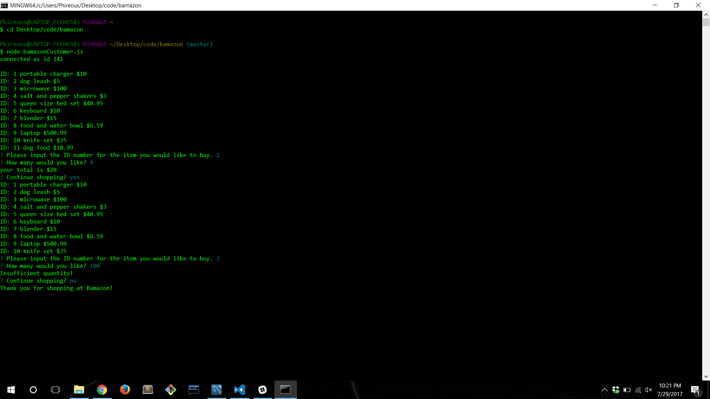
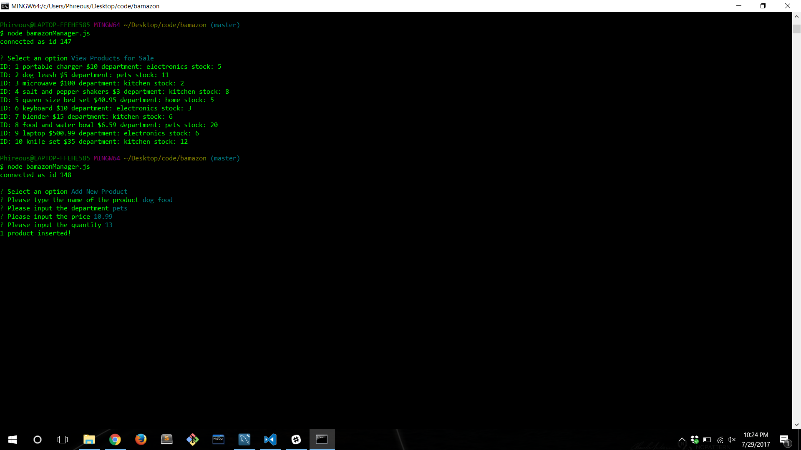

# bamazon
Image of what is loaded when bamazonCustomer.js is run

Image of the Mysql database/schema

User can select the items by ID and quantity to purchase.  The total is displayed and user id prompted to continue or not.

If user selects yes then items will be listed again and user continues as before. In this case the quantity is more than the stock of the item there for "insufficient quantity!" is displayed and user is prompted to continue.

Selecting "no" will display a thank you message.

This is displayed when bamazonManager.js is first run.

Selecting "View Products for Sale" will display all items.

Selecting "View Low Inventory" will display all items with less than 5 in stock.

Selecting "Add to Inventory" will prompt user to select and ID.

Then prompt user to input amount to add.

The items are then added into the database.

Selecting "Add New Product" will prompt user to input relevant info for the new item.

Database is then updated with new item.
